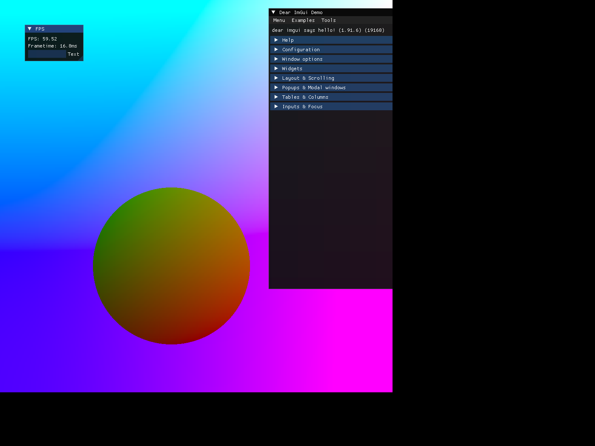

# Shaders (On the Web)

OpenGL compiled for web using Emscripten 😵‍💫😵

Most of C++ code is taken from my [other repository](https://github.com/mdhvg/shaders) which is purely for desktop



<p align="right"><i>-I am too tired to fix the aspect ratio</i></p>

## Building Instructions

> Requires EMSDK installed and set in system PATH (for all OS's)

- Recursively clone this repo

```bash
git clone --recursive https://github.com/mdhvg/opengl-web
cd opengl-web
```

- First do npm install

```bash
npm i
```

- Create build directory in src-cpp

```bash
cd src-cpp
mkdir build
```

# Linux/MacOS (Mac not tested)

- Build the C++ code

```bash
emcmake cmake -S . -B build -DPROGRAMS=noise
cmake --build build -j4
```

# Usage

Once the C++ files are built, change back to project root directory

```bash
cd opengl-web
```

Run like any other vite react project

```bash
npm run dev
```
